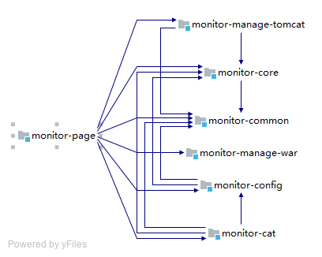

## log-monitor 日志监控与Tomcat控制 

2019/7/25 18:00:00
----------

**项目结构**

由图中我们可以看到入口为 monitor-page，这个模块既是入口也是前端页面存放的地方，旗下有6大模块做辅助：

- monitor-common

    1. 这个模块是存放公共代码的地方。

- monitor-config

    1. 这个模块是存放整个项目的配置文件的地方。

- monitor-cat

    1. 这个模块是存放日志查看的地方
    
- monitor-manage-tomcat

    1. 这个模块是存放 Tomcat管理的地方，包括对Tomcat的启动、配置文件的修改等。

- monitor-core

    1. 这个模块是存放整个项目的核心功能模块

- monitor-firewall

    1. 这个模块是存放对服务器防火墙管理及调整的地方
    
- monitor-manage-server

    1. 这个模块主要存放对服务器的管理、备份等操作
    
- monitor-manage-war

    1. 这个模块主要是针对War、Jar的操作
    
- monitor-message

    1. 这个模块主要是集成消息、通知等操作

----------

**Git版本控制**

----------

- **Clone 项目 + 分支（develop）工作流程**

	我们这里以log-monitor为例，我们进入如下地址看到我们所有的项目：
	[https://github.com/thenx-projects/log-monitor.git]
	
	1. 执行如下语句直接clone + 切换分支：
	
	`$ git clone -b develop https://github.com/thenx-projects/log-monitor.git`

	2. 增加主分支的最新代码可以用下面的命令切换:

		`$ git remote add upstream https://github.com/thenx-projects/log-monitor.git`

----------

- **push上传代码**
	
	1. 每次push前执行命令:

		`$ git pull --rebase upstream develop`

	2. 如果提示出现与
`error: Your local changes to the following files would be overwritten by merge:`
`	scripts/src/Strange.java`
`Please commit your changes or stash them before you merge.`

		类似的错误,先commit必要的文件,不想commit的文件用**git stash**命令将改动暂存起来,push命令成功后再用**git stash pop取出暂存**的改动

	3. 强制同步

	出现无法解决的push/merge冲突时执行下面两条命令可以强制将本地和fork仓库与上游仓库进行同步

	`$ git reset --hard upstream/master`

	`$ git push origin master --force`

	**注意: 这样做将会丢失本地和fork仓库所有未merge的更改,万不得已的情况下请确保如果有重要文件备份后再执行强制同步操作!!!**
	
*
*
*
*
*
*
*
*
*
*
*
*
*
*
*
*
*
*
*
*
*
*
*
*
*
*
*
*
*
*
*
*
*
*
*
*
*
*
*
*
*
*
*
*
*
*
*
*
*
*
*
*
*
*
*
*
*
*
*
*
*
*
*
*
*
*
*
*
*
*
*
*
*
*
*
*
*
*
*
*
*
*
*
*
*
*
*
*
*
*
*
*
*
*
*
*
*
*
*
*
*
*
*
*
*
*
*
*
*
*
*
*
*
*
*
*
*
*
*
*
*
*
*
*
*
*
*
*
*
*
*
*
*
*
*
*
*
*
*
*
*
*
*
*
*
*
*
*
*
*
*
*
*
*
*
*
*
*
*
*
*
*
*
*
*
*
*
*
*
*
*
*
*
*
*
*
*
*
*
*
*
*
*
*
*
*
*
*
*
*
*
*
*
*
*
*
*
*
*
*
*
*
*
*
*
*
*
*
*
*
*
*
*
*
*
*
*
*
*
*
*
*
*
*
*
*
*
*
*
*
*
*
*
*
*
*
*
*
*
*
*
*
*
*
*
*
*
*
*
*
*
*
*
*
*
*
*
*
*
*
*
*
*
*
*
*
*
*
*
*
*
*
*
*
*
*
*
*
*
*
*
*
*
*
*
*
*
*
*
*
*
*
*
*
*
*
*
*
*
*
*
*
*
*
*
*
*
*
*
*
*
*
*
*
*
*
*
*
*
*
*
*
*
*
*
*
*
*
*
*
*
*
*
*
*
*
*
*
*
*
*
*
*
*
*
*
*
*
*
*
*
*
*
*
*
*
*
*
*
*
*
*
*
*
*
*
*
*
*
*
*
*
*
*
*
*
*
*
*
*
*
*
*
*
*
*
*
*
*
*
*
*
*
*
*
*
*
*
*
*
*
*
*
*
*
*
*
*
*
*
*
*
*
*
*
*
*
*
*
*
*
*
*
*
*
*
*
*
*
*
*
*
*
*
*
*
*
*
*
*
*
*
*
*
*
*
*
*
*
*
*
*
*
*
*
*
*
*
*
*
*
*
*
*
*
*
*
*
*
*
*
*
*
*
*
*
*
*
*
*
*
*
*
*
*
*
*
*
*
*
*
*
*
*
*
*
*
*
*
*
*
*
*
*
*
*
*
*
*
*
*
*
*
*
*
*
*
*
*
*
*
*
*
*
*
*
*
*
*
*
*
*
*
*
*
*
*
*
*
*
*
*
*
*
*
*
*
*
*
*
*
*
*
*
*
*
*
*
*
*
*
*
*
*
*
*
*
*
*
*
*
*
*
*
*
*
*
*
*
*
*
*
*
*
*
*
*
*
*
*
*
*
*
*
*
*
*
*
*
*
*
*
*
*
*
*
*
*
*
*
*
*
*
*
*
*
*
*
*
*
*
*
*
*
*
*
*
*
*
*
*
*
*
*
*
*
*
*
*
*
*
*
*
*
*
*
*
*
*
*
*
*
*
*
*
*
*
*
*
*
*
*
*
*
*
*
*
*
*
*
*
*
*
*
*
*
*
*
*
*
*
*
*
*
*
*
*
*
*
*
*
*
*
*
*
*
*
*
*
*
*
*
*
*
*
*
*
*
*
*
*
*
*
*
*
*
*
*
*
*
*
*
*
*
*
*
*
*
*
*
*
*
*
*
*
*
*
*
*
*
*
*
*
*
*
*
*
*
*
*
*
*
*
*
*
*
*
*
*
*
*
*
*
*
*
*
*
*
*
*
*
*
*
*
*
*
*
*
*
*
*
*
*
*
*
*
*
*
*
*
*
*
*
*
*
*
*
*
*
*
*
*
*
*
*
*
*
*
*
*
*
*
*
*
*
*
*
*
*
*
*
*
*
*
*
*
*
*
*
*
*
*
*
*
*
*
*
*
*
*
*
*
*
*
*
*
*
*
*
*
*
*
*
*
*
*
*
*
*
*
*
*
*
*
*
*
*
*
*
*
*
*
*
*
*
*
*
*
*
*
*
*
*
*
*
*
*
*
*
*
*
*
*
*
*
*
*
*
*
*
*
*
*
*
*
*
*
*
*
*
*
*
*
*
*
*
*
*
*
*
*
*
*
*
*
*
*
*
*
*
*
*
*
*
*
*
*
*
*
*
*
*
*
*
*
*
*
*
*
*
*
*
*
*
*
*
*
*
*
*
*
*
*
*
*
*
*
*
*
*
*
*
*
*
*
*
*
*
*
*
*
*
*
*
*
*
*
*
*
*
*
*
*
*
*
*
*
